# Machine Learning with Real E-Commerce Data

Using 96k+ orders from **Olist** (Brazil's largest e-commerce platform) to explore machine learning end-to-end — feature engineering, baselines, ensemble methods, and advanced techniques.

[](https://python.org)
[](https://jupyter.org)
[](https://scikit-learn.org)
[](https://xgboost.readthedocs.io)
[](https://shap.readthedocs.io)

---

## Dataset

[Olist Brazilian E-Commerce](https://www.kaggle.com/datasets/olistbr/brazilian-ecommerce) — Kaggle &nbsp;·&nbsp; ~96,000 delivered orders &nbsp;·&nbsp; 9 relational tables &nbsp;·&nbsp; 2016–2018

| Table | Description |
|-------|-------------|
| `orders` | Order lifecycle and timestamps |
| `order_items` | Products, prices, sellers per order |
| `order_payments` | Payment type and value |
| `order_reviews` | Customer review scores and comments |
| `customers` | Customer location data |
| `products` | Product dimensions and category |
| `sellers` | Seller location data |
| `geolocation` | Brazilian zip code coordinates |
| `product_category_name_translation` | PT → EN category names |

---

## Project Structure

```
olist-ml-science/
├── notebooks/
│   ├── 01_feature_engineering_and_baselines.ipynb   # Data merging, features, LR & Decision Tree
│   ├── 02_ensemble_models_and_evaluation.ipynb      # Random Forest, Gradient Boosting, ROC/PR curves
│   └── 03_xgboost_shap_and_segmentation.ipynb      # XGBoost tuning, SHAP, K-Means segmentation
├── data/                                             # Olist CSV files (not tracked in git)
├── images/                                           # 18 charts generated across all 3 notebooks
└── requirements.txt
```

---

## What's inside

| Notebook | Topics |
|---|---|
| [01 Feature Engineering & Baselines](notebooks/01_feature_engineering_and_baselines.ipynb) | Merging 7 tables, target variable creation, feature engineering, LR, Decision Tree, confusion matrices |
| [02 Ensemble Models & Evaluation](notebooks/02_ensemble_models_and_evaluation.ipynb) | Random Forest, Gradient Boosting, 5-fold CV, ROC curves, Precision-Recall curves, feature importance |
| [03 XGBoost, SHAP & Segmentation](notebooks/03_xgboost_shap_and_segmentation.ipynb) | XGBoost + RandomizedSearchCV, SHAP beeswarm & dependence plots, RFM analysis, K-Means (k=4) |

---

## Part 1 — Feature Engineering & Baseline Models

### Class Distribution & Temporal Patterns

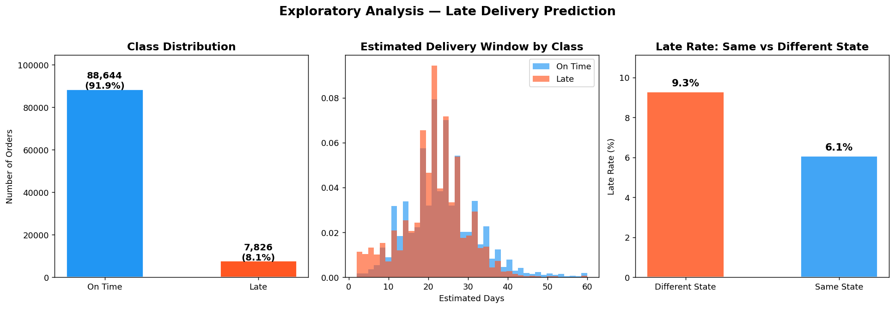

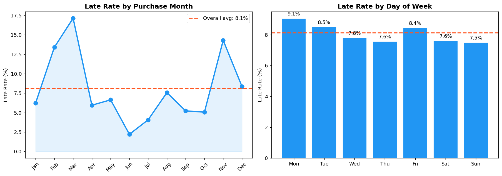

**Key insights:**
- **Class imbalance** — Only 8.1% of orders are late (7,826 out of 96,470). A naive model predicting "always on time" would score 91.9% accuracy — which is exactly why accuracy is the wrong metric here. Recall on the Late class is what matters.
- **Same-state effect** — Orders shipped within the same state have a noticeably lower late rate than cross-state deliveries. Geographic distance is a signal even before we measure it precisely.
- **November spike** — Late-delivery rate climbs in November, the month of Black Friday. The logistics network visibly strains under peak demand — this shows up in the data before you even fit a model.

### Confusion Matrices — Baseline Models

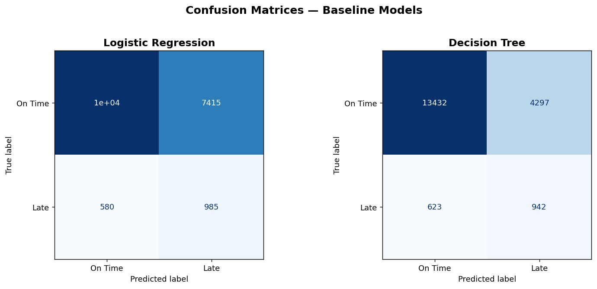

### Decision Tree Structure

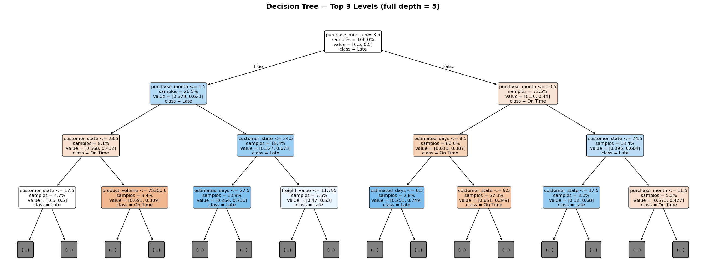

### Logistic Regression Coefficients

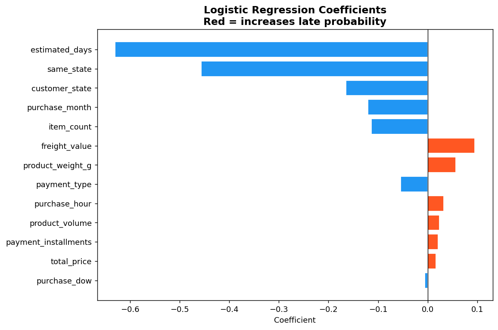

**Key insights:**
- **Decision tree splits first on `estimated_days`** — the logistics estimate itself is the strongest signal. Orders with longer promised windows are more likely to slip.
- **LR coefficients** — `estimated_days` and `freight_value` push the late-probability up; `same_state` and `purchase_hour` push it down. The directions are intuitive and sanity-check the feature engineering.
- **Recall vs precision tradeoff** — Logistic Regression with `class_weight='balanced'` catches 63% of late orders but generates many false alarms. Decision Tree is more conservative. Neither baseline is production-ready.

---

## Part 2 — Ensemble Models & Evaluation

### 5-Fold Cross-Validation

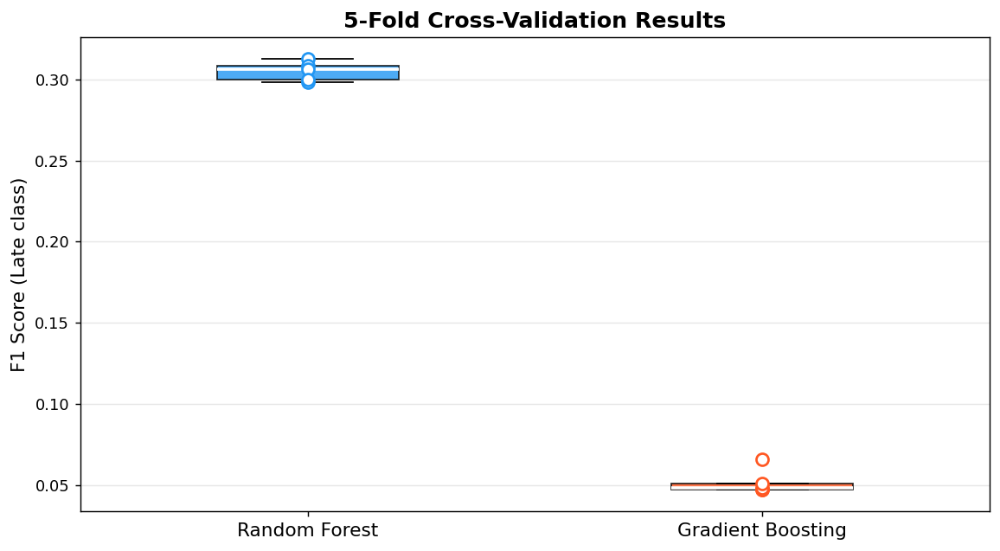

### ROC Curves

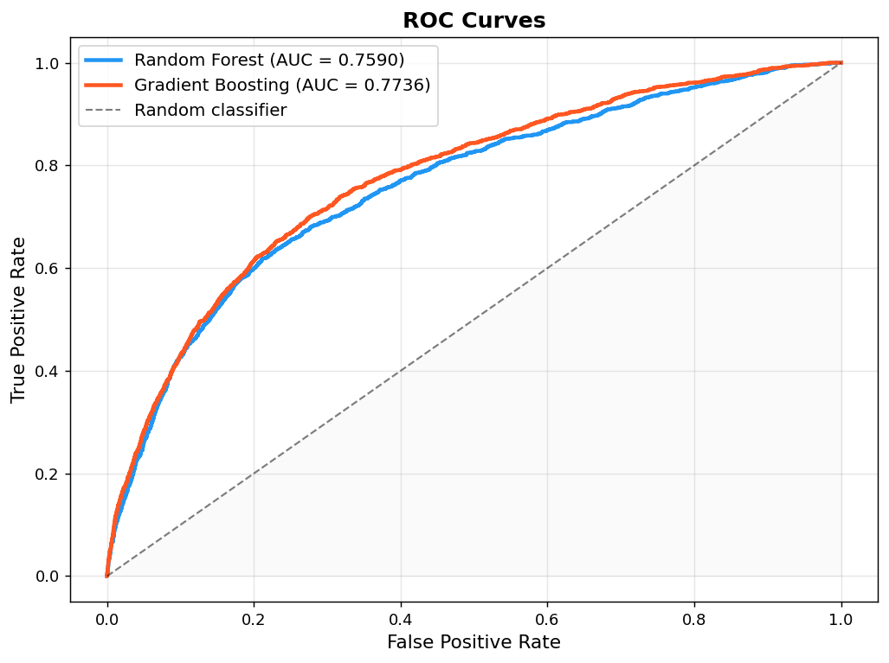

### Precision-Recall Curves

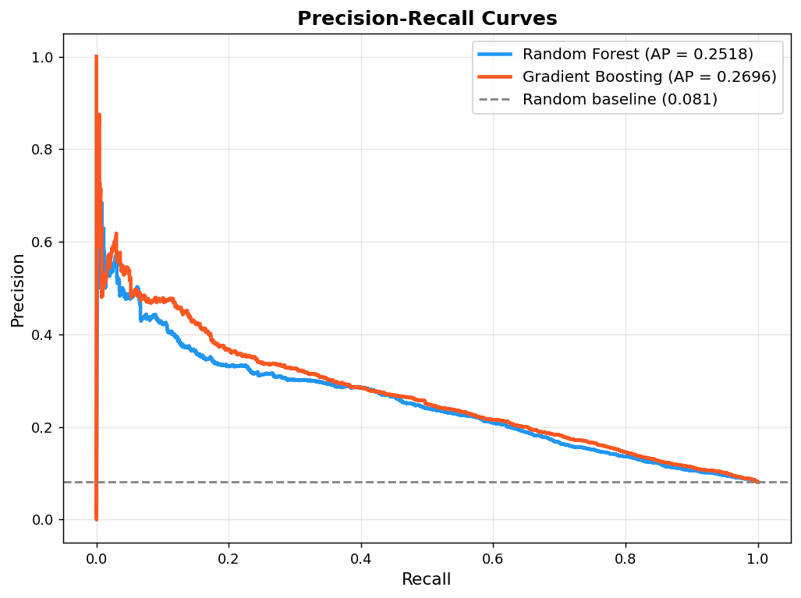

### Feature Importance

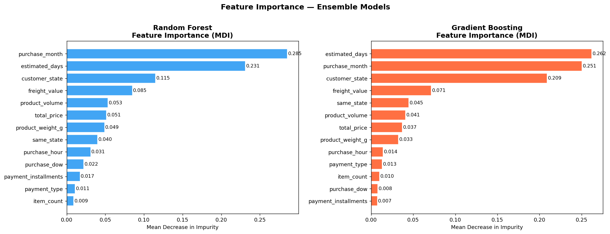

### Model Comparison

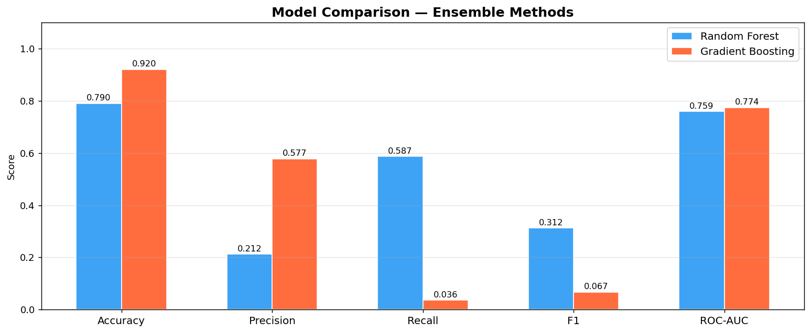

**Key insights:**
- **CV stability** — Both ensemble models show low variance across 5 folds (tight boxplots). The models aren't just getting lucky on a particular split — the signal is real and consistent.
- **ROC vs PR** — AUC-ROC looks flattering on imbalanced data because of the massive true-negative pool. The Precision-Recall curve is the honest test: both models comfortably beat the random baseline (AP ≈ 0.08), but there's clear room for improvement.
- **Feature importance consensus** — `estimated_days` tops both Random Forest and Gradient Boosting importance charts. `freight_value`, `customer_state`, and `product_weight_g` consistently rank in the top five — all logistics-related features.
- **Random Forest (F1=0.312, AUC=0.759) edges out Gradient Boosting (AUC=0.774)** on F1 due to better recall with class weighting. Gradient Boosting achieves higher AUC but at the cost of recall on the minority class.

---

## Part 3 — XGBoost, SHAP & Customer Segmentation

### Hyperparameter Tuning Results

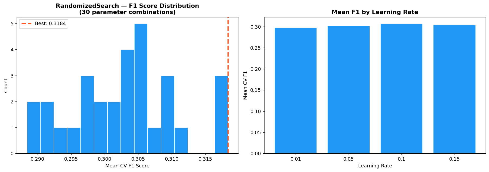

### SHAP Summary (Beeswarm)

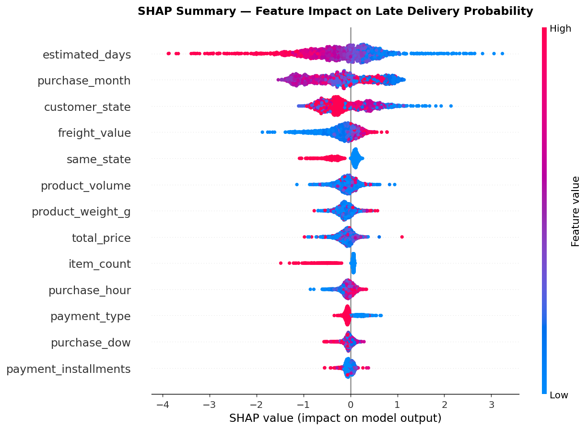

### SHAP Feature Importance

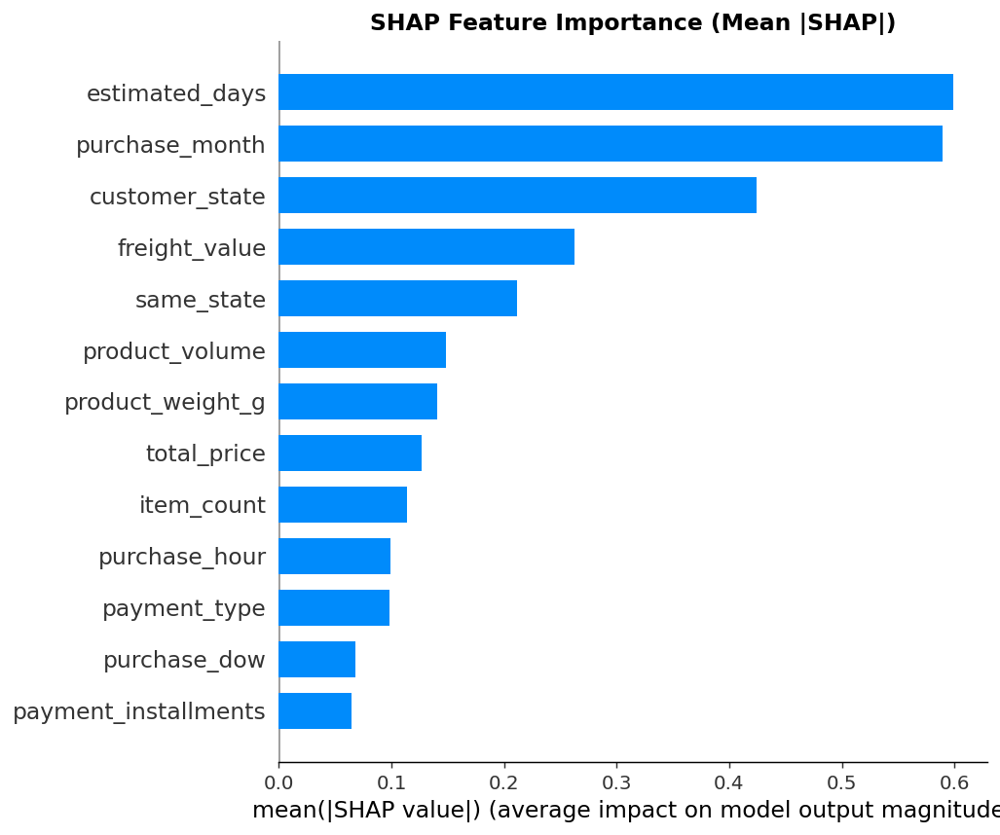

### SHAP Dependence — Estimated Days

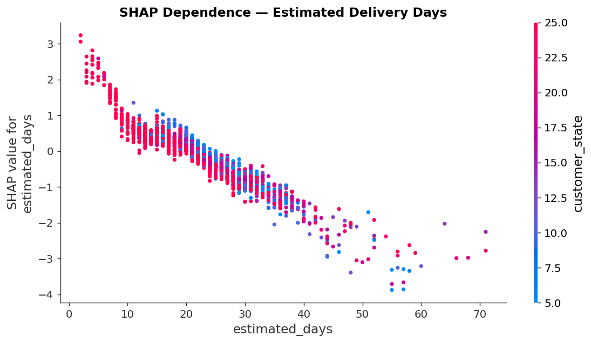

**Key insights:**
- **Tuning pays off** — RandomizedSearchCV over 30 combinations found the sweet spot: 600 trees, learning rate 0.05, depth 6. Smaller learning rates with more trees consistently dominated.
- **SHAP vs MDI importance** — Both agree on `estimated_days` as #1. SHAP adds something MDI can't: *direction*. Long estimated windows strongly push the model toward predicting "late". Short windows (<7 days) actually reduce late probability — fast-promised orders tend to be fulfilled more reliably.
- **`freight_value` and `same_state`** have clear, consistent SHAP directions — high freight pushes toward "late" (likely long-distance), same-state pushes toward "on time". The model learned real logistics relationships, not noise.

### Elbow Method — Optimal k

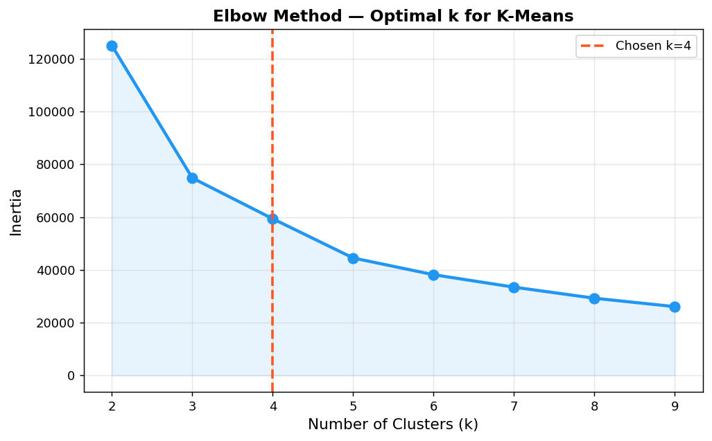

### Customer Segments (RFM Scatter)

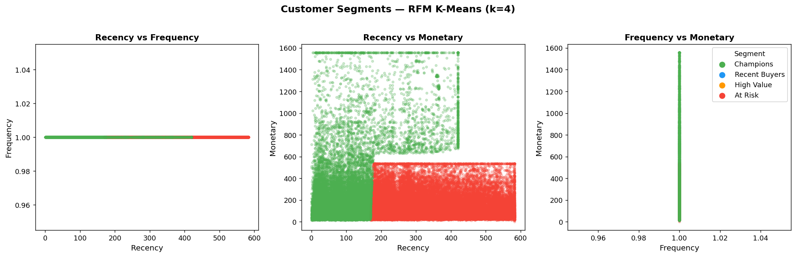

### Segment Profiles (Radar)

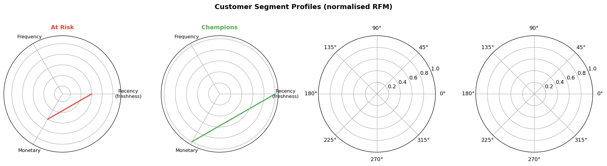

**Key insights:**
- **One-time buyer problem** — Frequency is ~1.0 across all four segments. Nearly every Olist customer ordered exactly once. Recency and Monetary become the only meaningful axes for segmentation.
- **High Value cluster (2,593 customers)** — Average spend of R$1,126 vs R$130–132 for all other segments. This tiny group (~2.7%) drives disproportionate revenue — they need targeted retention.
- **Lost segment (22,516 customers)** — Average recency of 458 days. These customers haven't ordered in over a year. Aggressive re-engagement campaigns or win-back offers are the business response.
- **Recent Buyers (35,641 customers)** — Recency of ~88 days. These are the most valuable acquisition targets for converting into repeat buyers — a loyalty incentive after their first purchase could shift the frequency problem.

### Final Model Comparison

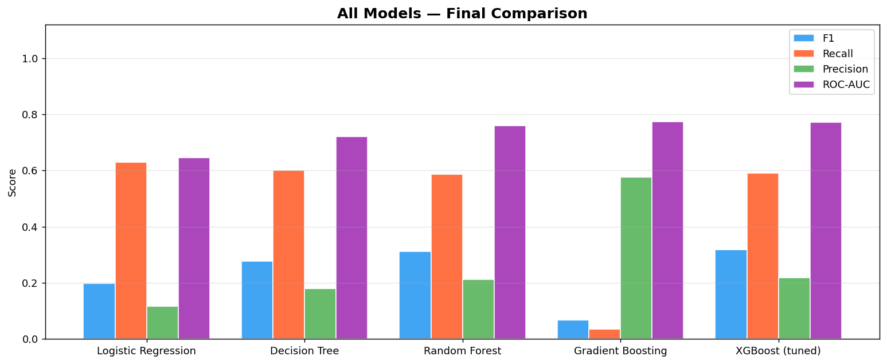

**Key insights:**
- Clear progression from baseline → ensemble → tuned boosting. XGBoost (tuned) achieves F1=0.318 and AUC=0.771, compared to Logistic Regression's F1=0.198 and AUC=0.645.
- On imbalanced binary classification, optimising for F1 forces the tradeoff between precision and recall to stay visible — you can't hide behind accuracy.

---

## ML Methods Covered

| Method | Notebook |
|--------|----------|
| Merging relational tables (7 CSV joins) | 01 |
| Target variable engineering (binary) | 01 |
| Temporal feature extraction (DOW, month, hour) | 01 |
| Label encoding | 01 |
| StandardScaler | 01 |
| Logistic Regression (class_weight='balanced') | 01 |
| Decision Tree (max_depth, min_samples_leaf) | 01 |
| Confusion matrix & classification report | 01 |
| Random Forest (bagging, n_jobs=-1) | 02 |
| Gradient Boosting (boosting, subsample) | 02 |
| StratifiedKFold cross-validation (5-fold) | 02 |
| ROC curve & AUC-ROC | 02 |
| Precision-Recall curve & Average Precision | 02 |
| MDI Feature importance | 02 |
| XGBoost (scale_pos_weight, reg_alpha/lambda) | 03 |
| RandomizedSearchCV (30 iterations) | 03 |
| SHAP TreeExplainer | 03 |
| SHAP beeswarm summary plot | 03 |
| SHAP dependence plot | 03 |
| RFM analysis (Recency, Frequency, Monetary) | 03 |
| K-Means clustering | 03 |
| Elbow method (inertia vs k) | 03 |
| Customer segment profiling (radar chart) | 03 |

---

## Key Findings

| Finding | Value |
|---------|-------|
| Total delivered orders | 96,470 |
| Late delivery rate | **8.1%** (7,826 orders) |
| Train / Test split | 77,176 / 19,294 (80/20, stratified) |
| Features used | 13 (temporal, logistics, product, payment, geo) |
| Logistic Regression — F1 / AUC | 0.198 / 0.645 |
| Decision Tree — F1 / AUC | 0.277 / 0.720 |
| Random Forest — F1 / AUC | 0.312 / 0.759 |
| XGBoost (tuned) — F1 / AUC | **0.318 / 0.771** |
| Best CV F1 (XGBoost, 5-fold) | 0.3184 |
| Top predictive feature | `estimated_days` (confirmed by MDI + SHAP) |
| Unique customers in dataset | 96,470 — nearly all one-time buyers |
| High Value segment size | 2,593 customers (avg spend R$1,126) |
| Lost segment size | 22,516 customers (avg recency 458 days) |

---

## Tech Stack


---

## How to Run

This project reads data from a sibling folder. **Both repos must be cloned into the same parent directory.**

```bash
# 1. Create a parent folder and clone both repos into it
mkdir olist-projects && cd olist-projects

git clone https://github.com/sualpsudas/olist-statistics-science.git
git clone https://github.com/sualpsudas/olist-ml-science.git

# Your folder structure should look like this:
# olist-projects/
# ├── olist-statistics-science/
# │   └── data/          ← CSV files go here
# └── olist-ml-science/  ← this repo

# 2. Download the Olist dataset from Kaggle
# https://www.kaggle.com/datasets/olistbr/brazilian-ecommerce
# Extract and place all CSV files into: olist-statistics-science/data/

# 3. Install dependencies
cd olist-ml-science
conda create -n ml-env python=3.11 -y
conda activate ml-env
pip install -r requirements.txt

# 4. Run notebooks in order (artifacts are passed 01 → 02 → 03)
jupyter notebook notebooks/01_feature_engineering_and_baselines.ipynb
```

---

*Dataset: [Olist @ Kaggle](https://www.kaggle.com/datasets/olistbr/brazilian-ecommerce) — CC BY-NC-SA 4.0*
